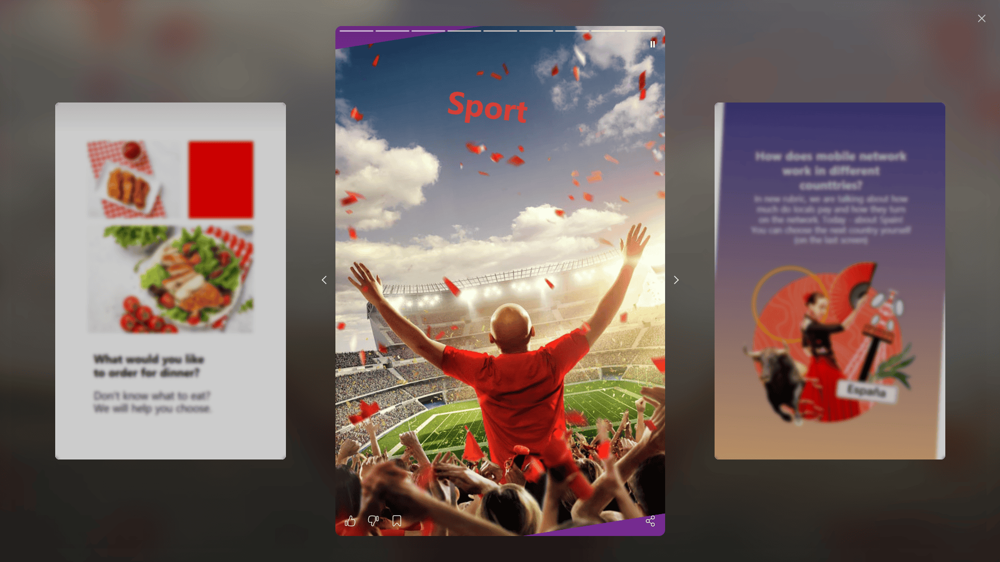
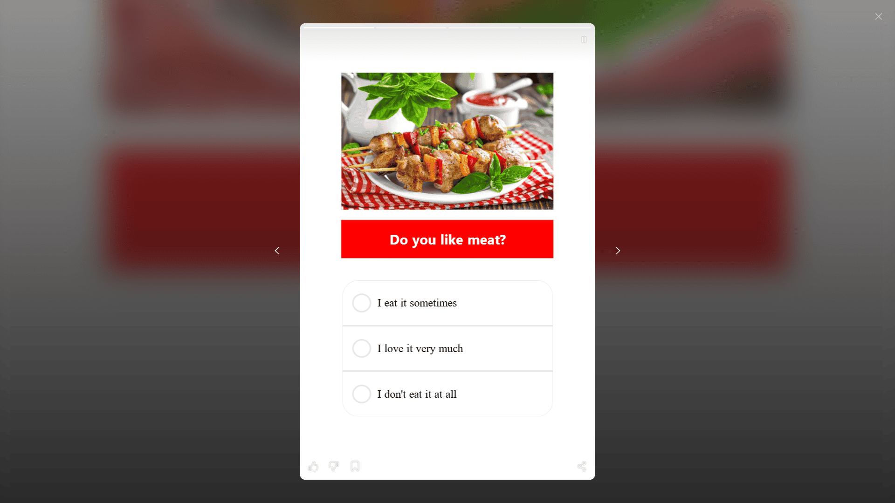

# Story View

## Layout

The **Story View** supports two layout modes that can be configured using the `layout` parameter.

### Modern Layout



To use the modern layout, set the parameter as follows:

```tsx
appearanceManager.setStoryReaderOptions({
  layout: StoryReaderLayout.Modern,
});
```

### Classic Layout



To use the classic layout, set the parameter as follows:

```ts
appearanceManager.setStoryReaderOptions({
  layout: StoryReaderLayout.Classic,
});
```

---

## Customization

Below are the configuration options for customizing the Story View appearance.

### Common options

Common settings of the modal window for viewing story (close button, loader)

| Variable                   | Type   | Description                                                                           |
| -------------------------- | ------ | ------------------------------------------------------------------------------------- |
| closeButtonPosition        | string | Close button position, one of `start`, `end` (for all readers).                       |
| closeButton                | object | Close button svg icon. (for all readers)                                              |
| loader.default.color       | string | Default loader primary color. Valid css color. Default - white (for all readers)      |
| loader.default.accentColor | string | Default loader accent color. Valid css color. Default - transparent (for all readers) |

```ts
appearanceManager.setCommonOptions({
    closeButton: {
        svgSrc: {
            baseState: "<svg>...</svg>"
        };
    }
})
```

### Options

| Parameter                    | Type                | Description                                                                                                                                 |
| ---------------------------- | ------------------- | ------------------------------------------------------------------------------------------------------------------------------------------- |
| `closeButtonPosition`        | string              | Position of the close button. Possible values: `start`, `end`. Values `left` and `right` are marked as `deprecated` since version `2.14.0`. |
| `scrollStyle`                | string              | Scroll style of the story view pager. Possible values: `flat`, `cover`, `cube`.                                                             |
| `loader.default.color`       | string              | Primary loader color. Any valid CSS color. Default: `white`.                                                                                |
| `loader.default.accentColor` | string              | Loader accent color. Any valid CSS color. Default: `transparent`.                                                                           |
| `sharePanel`                 | object              | [Share panel options](./share-panel.md).                                                                                                    |
| `commonBackdrop`             | object              | [Backdrop options](#story-backdrop-options) for the StoryReader.                                                                            |
| `slideBackdrop`              | object              | [Backdrop options](#story-slide-backdrop-options) for story slides.                                                                         |
| `timelineBlockTopOffset`     | number \| undefined | Top offset (in px) of the timeline block. Default: `5`. Expands the backdrop below the block as well.                                       |
| `actionPanelBottomOffset`    | number \| undefined | Bottom offset (in px) of the ActionPanel. Default: `0`. Also increases ActionPanel height.                                                  |
| `closeButton`                | object              | Override close button SVG icon.                                                                                                             |
| `likeButton`                 | object              | Override like button SVG icon.                                                                                                              |
| `dislikeButton`              | object              | Override dislike button SVG icon.                                                                                                           |
| `favoriteButton`             | object              | Override favorite button SVG icon.                                                                                                          |
| `muteButton`                 | object              | Override mute button SVG icon.                                                                                                              |
| `shareButton`                | object              | Override share button SVG icon.                                                                                                             |
| `navigation`                 | object              | [Override navigation](#story-navigation-options) buttons SVG icons.                                                                         |
| `borderRadius`               | number              | Border radius of stories in px. Default: `5`.                                                                                               |
| `layout`                     | string              | Story view layout. Possible values: `modern`, `classic`. Default: `classic`.                                                                |

---

### Story backdrop options

Configuration for the common backdrop.

| Parameter        | Type           | Description                                                                               |
| ---------------- | -------------- | ----------------------------------------------------------------------------------------- |
| `color`          | string         | Backdrop color. Any valid CSS color. Example: `rgba(0,0,0,.3)`. Default: `rgba(0,0,0,1)`. |
| `backdropFilter` | string \| null | CSS filter for the backdrop. Example: `blur(10px)`. Default: `null`.                      |

---

### Story slide backdrop options

| Variable                | Type            | Description                                                                                                                       |
| ----------------------- | --------------- | --------------------------------------------------------------------------------------------------------------------------------- |
| `opacity`               | number          | Slide based image backdrop - opacity value. Default `.56`                                                                         |
| `blur`                  | number          | Slide based image backdrop - blur value. Default `30`                                                                             |
| `linearGradientOverlay` | Array`<string>` | Slide based image backdrop - Linear gradient overlay values. Default &#91;`rgba(0, 0, 0, 0.1) 0%`, `rgba(0, 0, 0, 0.9) 100%`&#93; |

#### Story navigation options

| Variable                    | Type   | Description                                                                                                        |
| --------------------------- | ------ | ------------------------------------------------------------------------------------------------------------------ |
| svgSrc                      | object | Svg button sources for different states. Button touchable size is 32x32px. You can use the icon up to these sizes. |
| prevButton.svgSrc.baseState | string | `<svg>...</svg>`                                                                                                   |
| nextButton.svgSrc.baseState | string | `<svg>...</svg>`                                                                                                   |

### Examples

#### Copy of default config

```ts
appearanceManager.setStoryReaderOptions({
  commonBackdrop: {
    color: 'rgba(51, 51, 51, 1)',
    backdropFilter: null,
  },
  slideBackdrop: {
    opacity: 0.56,
    blur: 30,
    linearGradientOverlay: ['rgba(0, 0, 0, 0.1) 0%', 'rgba(0, 0, 0, 0.9) 100%'],
  },
});
```

#### Translucent config without slide based backdrop image

```ts
appearanceManager.setStoryReaderOptions({
  commonBackdrop: {
    color: 'rgba(51, 51, 51, .8)',
    backdropFilter: null,
  },
  slideBackdrop: {
    opacity: 0,
    blur: 30,
    linearGradientOverlay: ['rgba(0, 0, 0, 0.1) 0%', 'rgba(0, 0, 0, 0.9) 100%'],
  },
});
```

#### Translucent config without slide based backdrop image and parent screen blur effect

```ts
appearanceManager.setStoryReaderOptions({
  commonBackdrop: {
    color: 'rgba(51, 51, 51, .2)',
    backdropFilter: 'blur(5px)',
  },
  slideBackdrop: {
    opacity: 0,
    blur: 30,
    linearGradientOverlay: ['rgba(0, 0, 0, 0.1) 0%', 'rgba(0, 0, 0, 0.9) 100%'],
  },
});
```

---

## Action Bar

The **Action Bar** is a key UI element that provides quick access to core interactive features. It consists of a set of intuitive icons, each responsible for a specific action.

### Actions

- **Like / Dislike**

  Allows the user to express positive or negative feedback about the content.

- **Add to Favorites / Remove from Favorites**

  Adds the content to a Favorites list for quick future access or removes it from the list.

- **Share**

  Opens a sharing panel:
  - Desktop: bottom sheet,
  - Mobile: system share menu.

- **Mute / Unmute**

  Controls media playback sound (video, audio, ads). Allows enabling or disabling sound instantly without interrupting playback.

### Options

You can enable/disable controls using `appearanceManager.setCommonOptions()` method

```ts
appearanceManager.setCommonOptions({
  hasLike: true,
  hasFavorite: true,
  hasShare: true,
});
```

| Parameter     | Type    | Description                                          |
| ------------- | ------- | ---------------------------------------------------- |
| `hasLike`     | boolean | Enables the Like / Dislike action. Default `false`   |
| `hasFavorite` | boolean | Enables the Add to Favorites action. Default `false` |
| `hasShare`    | boolean | Enables the Share action. Default `false`            |

### StoryReader customization

- **Customize `like` or `dislike` button icon**

```ts
appearanceManager.setStoryReaderOptions({
  likeButton: {
    svgSrc: {
      baseState: '<svg>...</svg>',
    },
  },
  dislikeButton: {
    svgSrc: {
      baseState: '<svg>...</svg>',
    },
  },
});
```

- **Customize `favorite` button icon**

```ts
appearanceManager.setStoryReaderOptions({
  favoriteButton: {
    svgSrc: {
      baseState: '<svg>...</svg>',
    },
  },
});
```

- **Customize `share` button icon**

```ts
appearanceManager.setStoryReaderOptions({
  shareButton: {
    svgSrc: {
      baseState: '<svg>...</svg>',
    },
  },
});
```

- **Customize action bar position**

```ts
appearanceManager.setStoryReaderOptions({
  actionPanelBottomOffset: 20,
});
```

## Events

```ts
import { InAppStoryManager } from '@inappstory/js-sdk';

const inAppStoryManager = new InAppStoryManager({ apiKey: '{projectToken}' });
inAppStoryManager.on('clickOnStory', (payload) => console.log(payload));
```

---

- [`showStory`](#showstory)
- [`closeStory`](#closestory)
- [`showSlide`](#showslide)
- [`likeStory`](#likestory)
- [`dislikeStory`](#dislikestory)
- [`favoriteStory`](#favoritestory)
- [`shareStory`](#sharestory)
- [`shareStoryWithPath`](#sharestorywithpath)
- [`feedImpression`](./events.md#feedimpression)
- [`visibleAreaUpdated`](./events.md#visibleareaupdated)
- [`widgetEvent`](#widgetevent)

---

### `showStory`

**Description:** Triggered when a story is opened (from slider or reader).

**Payload:**

| Field                | Type    | Description                        |
| -------------------- | ------- | ---------------------------------- |
| `id`                 | number  | Story ID.                          |
| `title`              | string? | Story title.                       |
| `slidesCount`        | number? | Number of slides in the story.     |
| `feed`               | string? | Feed name where the story belongs. |
| `source`             | string? | Story source.                      |
| `filter`             | object  | Applied filters.                   |
| `ugcPayload`         | object  | UGC-related payload.               |
| `defaultListLength`  | number  | Default list length.               |
| `favoriteListLength` | number  | Favorite list length.              |

---

### `closeStory`

**Description:** Triggered when a story is closed.

**Payload:**

| Field                | Type    | Description                                                                                                                           |
| -------------------- | ------- | ------------------------------------------------------------------------------------------------------------------------------------- |
| `id`                 | number  | Story ID.                                                                                                                             |
| `title`              | string? | Story title.                                                                                                                          |
| `slidesCount`        | number? | Number of slides in the story.                                                                                                        |
| `feed`               | string? | Feed name where the story belongs.                                                                                                    |
| `source`             | string? | Story source.                                                                                                                         |
| `filter`             | object  | Applied filters.                                                                                                                      |
| `ugcPayload`         | object  | UGC-related payload.                                                                                                                  |
| `defaultListLength`  | number  | Default list length.                                                                                                                  |
| `favoriteListLength` | number  | Favorite list length.                                                                                                                 |
| `action`             | string  | Close action (`closeReaderByCloseBtn`, `closeReaderByEscBtn`, `swipeDown`, `swipe`, `lastSlideClick`, `auto`, `externalCloseReader`). |

---

### `showSlide`

**Description:** Triggered when a slide is shown.

**Payload:**

| Field                | Type    | Description                        |
| -------------------- | ------- | ---------------------------------- |
| `id`                 | number  | Story ID.                          |
| `title`              | string? | Story title.                       |
| `slidesCount`        | number? | Number of slides in the story.     |
| `feed`               | string? | Feed name where the story belongs. |
| `source`             | string? | Story source.                      |
| `filter`             | object  | Applied filters.                   |
| `ugcPayload`         | object  | UGC-related payload.               |
| `defaultListLength`  | number  | Default list length.               |
| `favoriteListLength` | number  | Favorite list length.              |
| `index`              | number  | Slide index.                       |
| `payload`            | string  | Slide payload.                     |

---

### `likeStory`

**Description:** Triggered when a user likes/unlikes a story.

**Payload:**

| Field                | Type    | Description                          |
| -------------------- | ------- | ------------------------------------ |
| `id`                 | number  | Story ID.                            |
| `title`              | string? | Story title.                         |
| `slidesCount`        | number? | Number of slides in the story.       |
| `feed`               | string? | Feed name where the story belongs.   |
| `source`             | string? | Story source.                        |
| `filter`             | object  | Applied filters.                     |
| `ugcPayload`         | object  | UGC-related payload.                 |
| `defaultListLength`  | number  | Default list length.                 |
| `favoriteListLength` | number  | Favorite list length.                |
| `value`              | boolean | `true` if liked, `false` if unliked. |

---

### `dislikeStory`

**Description:** Triggered when a user dislikes/undislikes a story.

**Payload:**

| Field                | Type    | Description                             |
| -------------------- | ------- | --------------------------------------- |
| `id`                 | number  | Story ID.                               |
| `title`              | string? | Story title.                            |
| `slidesCount`        | number? | Number of slides in the story.          |
| `feed`               | string? | Feed name where the story belongs.      |
| `source`             | string? | Story source.                           |
| `filter`             | object  | Applied filters.                        |
| `ugcPayload`         | object  | UGC-related payload.                    |
| `defaultListLength`  | number  | Default list length.                    |
| `favoriteListLength` | number  | Favorite list length.                   |
| `value`              | boolean | `true` if disliked, `false` if removed. |

---

### `favoriteStory`

**Description:** Triggered when a user adds/removes a story to favorites.

**Payload:**

| Field                | Type    | Description                              |
| -------------------- | ------- | ---------------------------------------- |
| `id`                 | number  | Story ID.                                |
| `title`              | string? | Story title.                             |
| `slidesCount`        | number? | Number of slides in the story.           |
| `feed`               | string? | Feed name where the story belongs.       |
| `source`             | string? | Story source.                            |
| `filter`             | object  | Applied filters.                         |
| `ugcPayload`         | object  | UGC-related payload.                     |
| `defaultListLength`  | number  | Default list length.                     |
| `favoriteListLength` | number  | Favorite list length.                    |
| `value`              | boolean | `true` if favorited, `false` if removed. |

---

### `shareStory`

**Description:** Triggered when a user clicks on story sharing.

**Payload:**

| Field                | Type    | Description                        |
| -------------------- | ------- | ---------------------------------- |
| `id`                 | number  | Story ID.                          |
| `title`              | string? | Story title.                       |
| `slidesCount`        | number? | Number of slides in the story.     |
| `feed`               | string? | Feed name where the story belongs. |
| `source`             | string? | Story source.                      |
| `filter`             | object  | Applied filters.                   |
| `ugcPayload`         | object  | UGC-related payload.               |
| `defaultListLength`  | number  | Default list length.               |
| `favoriteListLength` | number  | Favorite list length.              |

---

### `shareStoryWithPath`

**Description:** Triggered after successful creation of the sharing path.

**Payload:**

| Field                | Type    | Description                        |
| -------------------- | ------- | ---------------------------------- |
| `id`                 | number  | Story ID.                          |
| `title`              | string? | Story title.                       |
| `slidesCount`        | number? | Number of slides in the story.     |
| `feed`               | string? | Feed name where the story belongs. |
| `source`             | string? | Story source.                      |
| `filter`             | object  | Applied filters.                   |
| `ugcPayload`         | object  | UGC-related payload.               |
| `defaultListLength`  | number  | Default list length.               |
| `favoriteListLength` | number  | Favorite list length.              |
| `url`                | string  | Generated sharing URL.             |

---

### `widgetEvent`

**Description:** Triggered by widgets inside a story.

**Payload:**

| Field  | Type   | Description           |
| ------ | ------ | --------------------- |
| `name` | string | Widget name.          |
| `data` | any    | Widget-specific data. |
